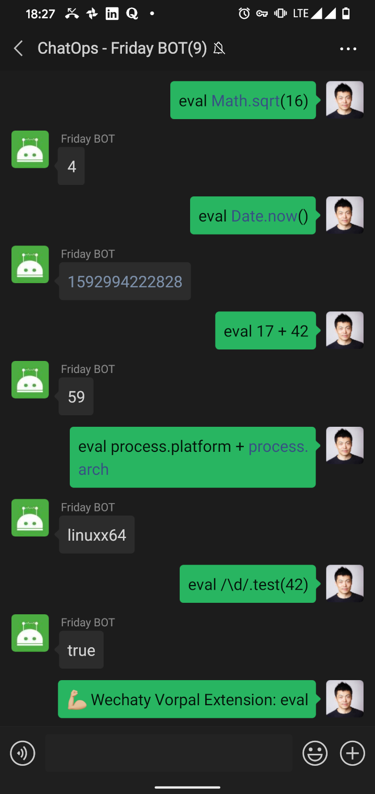

# wechaty-vorpal-contrib

[](https://github.com/wechaty/wechaty-vorpal)
[](https://github.com/wechaty/wechaty-vorpal-contrib/actions?query=workflow%3ANPM)
 [](https://www.npmjs.com/package/wechaty-vorpal-contrib)

Wechaty Vorpal Chat CLI (Command Line Interface)

[](https://github.com/wechaty/wechaty-vorpal-contrib)

> Image: [Tales of Zestiria](https://shyonaaisha.tumblr.com/post/146096253441/neylakiiroisenkou-tales-of-zestiria-weapons)

## Requirements

1. Node.js v12+
1. [Wechaty](https://github.com/wechaty/wechaty) v0.40+
1. [WechatyVorpal](https://github.com/wechaty/wechaty-vorpal) v0.2+

## Usage

You are welcome to send your Vorpal Extension to our contrib by creating a Pull Request!

| # | Extension | Author | Feature |
| :--- | :--- | :--- | :--- |
| 1 | Ding | @huan | Get a reply of `dong` |
| 2 | Eval | @huan | Run JavaSCript in your Wechaty bot right in the chat window! |
| 3 | Cash | @huan | Cross-platform Linux commands in pure ES6 |

```ts
import { Wechaty }        from 'wechaty'
import { WechatyVorpal }  from 'wechaty-vorpal'
import { Eval }           from 'wechaty-vorpal-contrib'

const vorpalExtensionList = [
  Eval(), // <- Put our vorpal contrib extensions at here.
]

const VorpalPlugin = WechatyVorpal({
  room: 'Your_Vorpal_CLI_Room_ID',
  use: vorpalExtensionList,
})

const wechaty = new Wechaty()
wechaty.use(VorpalPlugin)
```

## Screenshot

### UrlLink


### Eval



## Commands

[](https://github.com/wechaty/wechaty-vorpal-contrib)

The Wechaty Vorpal Contrib includes the most useful commands from the Wechaty Contributors.

If you believe we should add more command to the contrib, please feel free to submit an proposal by creating an new issue, with your code in the PR!

### 1 Ding

```ts
import { Ding } from 'wechaty-vorpal-contrib'
vorpalExtensionList = [ Ding() ]
```

### 2 Eval

```ts
import { Eval } from 'wechaty-vorpal-contrib'
vorpalExtensionList = [ Eval() ]
```

### 3 Cash

Cash is a cross-platform implementation of Unix shell commands written in straight ES6. No native compiling and no external dependencies.

```ts
import { Cash } from 'wechaty-vorpal-contrib'
vorpalExtensionList = [ Cash() ]
```

```sh
$ help

  Commands:

    alias [options] [name...]
    cat [options] [files...]
    cd [dir]
    clear
    cp [options] [args...]
    echo [options] [arg...]
     [options] [files...]
    export [options] [name...]
    false
    kill [options] [process...]
    ls [options] [paths...]
     [options] [directory...]
     [options] [args...]
    pwd [files...]
    sort [options] [files...]
    source [file] [params...]
    tail [options] [files...]
    touch [options] <files...>
    true
    grep [options] <pattern> [files...]  Grep (POSIX) implementation.
    rm [options] [files...]
     [options] [name...]
```

This extension is powered by [Cash](https://github.com/dthree/cash).

Learn more supported command at <https://github.com/dthree/cash#supported-commands>

## History

### v0.2 (Jun 19, 2020)

Init the first version of Wechaty Vorpal Extensions for official Wechaty ChatOps Commands

1. `Ding` Extension for trigger a `dong` reply
1. `Eval` Extension for EVAL JavaScript code from the chat window!
1. `Cash` Extension for Cross-platform Linux commands in pure ES6

## Contributors

[](https://sourcerer.io/fame/huan/wechaty/wechaty-vorpal-contrib/links/0)
[](https://sourcerer.io/fame/huan/wechaty/wechaty-vorpal-contrib/links/1)
[](https://sourcerer.io/fame/huan/wechaty/wechaty-vorpal-contrib/links/2)
[](https://sourcerer.io/fame/huan/wechaty/wechaty-vorpal-contrib/links/3)
[](https://sourcerer.io/fame/huan/wechaty/wechaty-vorpal-contrib/links/4)
[](https://sourcerer.io/fame/huan/wechaty/wechaty-vorpal-contrib/links/5)
[](https://sourcerer.io/fame/huan/wechaty/wechaty-vorpal-contrib/links/6)
[](https://sourcerer.io/fame/huan/wechaty/wechaty-vorpal-contrib/links/7)

## Author

[Huan LI](https://github.com/huan) ([李卓桓](http://linkedin.com/in/zixia)), Tencent TVP of Chatbot, \<zixia@zixia.net\>

[](https://stackexchange.com/users/265499)

## Copyright & License

- Code & Docs © 2020 Huan LI (李卓桓) \<zixia@zixia.net\>
- Code released under the Apache-2.0 License
- Docs released under Creative Commons
